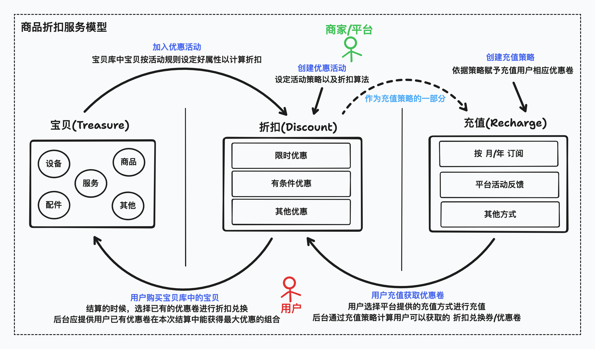

## go-treasure
一个简单的商品折扣服务。

### 源起
这事起源于一个开放性的面试题，总结来说就是在一个在线商城中，设计一套灵活的商品折扣服务系统，商家可以动态的创建折扣优惠活动，用户可以通过多种方式加入活动，商家通过活动卖出更多商品，用户也能从活动中获得折扣实惠，并且也活跃了商城的交易流量。

### 设想
- 商家的视角: 创建优惠活动、商品加入活动；
- 用户的视角: 充值购买优惠卷、浏览商品(详情/价格/折扣优惠)、选择商品加入购物车、购物车结算(使用最佳的优惠卷组合兑现折扣)；
- 平台的视角: 优惠活动的创建机制、商品加入活动的机制、用户充值获取优惠卷的机制、用户优惠卷的管理机制(过期处理、兑现机制、优先组合机制等等)、用户购物车结算机制、商家优惠活动结算机制等等；

### 简单设计

[(Shared tldraw project for go-treasure)](https://www.tldraw.com/r/MMZYfboeVp6cGLt9znQd0?viewport=-39%2C-147%2C1792%2C1020&page=page%3Apage 'shared tldraw project')

### 方案
TODO；
